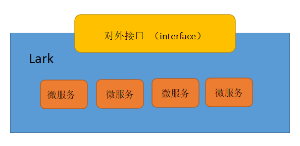

# lark 微服务系统


## 环境准备
### redis
### mysql
### etcd
### elasticsearch
## apps 存放所有微服务
### interface 对外接口层
> * interface_http 服务
```
interface_http 为以http形式对外提供服务的接口，负责接收外部请求和向外部提供应答。对外接口层可以有多种实现，可针对不同平台设计
```
### 内部微服务
> * config
```
config 负责配置文件的统一处理服务
```
### com 系统共用模块
#### api 服务器启动模块封装
#### dbtables 数据库表结构文件
#### files 文件操作相关
#### pkgs 相应底层功能的封装
#### utils 通用函数的封装
### doc 系统文档文件
### examples 系统的测试用例
### pb proto buff 的生成文件
### pbfiles proto buff 的源文件